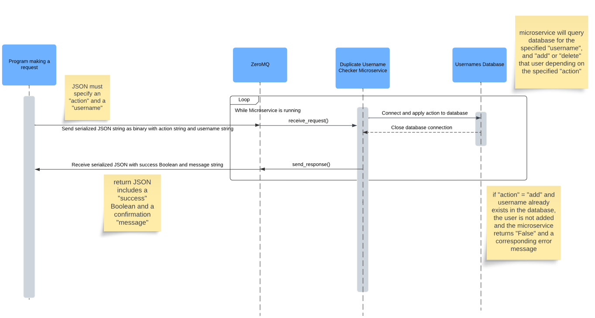

# Duplicate Username Checker

## Table of Contents

- [Description](#description)
- [Installation](#installation)
- [Communication Contract](#communication-contract)
- [License](#license)

## Description

The **Duplicate Username Checker** microservice creates a local SQLite database. Other applications can send requests to this service to add or
delete usernames from the database. The service ensures that no duplicate usernames are added to the database.

Note: The _test_client.py_ script was included for demonstration purposes only.

## Installation

Note: This project was written and tested in Python 3.12.0. Although it may run in earlier versions of Python, I recommend 
using Python 3.12 or newer.

1. Install SQLite.
   - On Windows, navigate to the SQLite [downloads page](https://www.sqlite.org/download.html) and download the _sqlite-tools-win-x64_ zip file under **Precompiled Binaries for Windows**.
      (Note: Versions for other operating systems are available on the same page.)
   - Extract the zip file to a folder, such as _C:\User\SQLite_. 
   - Add SQLite to the **path** in Windows. 
   - Navigate to **Control Panel > System > Advanced system settings**
   - Click on **Environment Variables**
   - Click on the row with the **Path** variable and select **Edit...**
   - Click **New** and enter the path to the folder containing the sqlite3.exe, for example _C:\User\SQLite_
   - Click **OK** to save the changes
   - **Close** and restart any open Command Prompt windows
   - To test that the installation was successful, open a new Command Prompt and type:
       ```shell
        sqlite3 --version
        ```
   - The output should show the SQLite version, which confirms successful installation of SQLite
2. Clone the repository to your local machine:
    ```shell
    git clone https://github.com/evacgriffin/username-checker.git
   ```
3. Navigate into the project directory:
   ```shell
   cd username-checker
   ```
4. Run checker.py:
   ```shell
   python checker.py
   ```
5. The duplicate username checker is now ready to receive requests from other applications.
6. _Optional_: Run the _print_db.py_ script to print out the contents of the database or use an external database UI tool. 
I recommend the free open source software _DB Browser for SQLite_ which can be downloaded [here](https://sqlitebrowser.org/dl/).
7. _Troubleshooting Note_: If you receive an **OptionalError: database is locked** error while running the microservice, 
ensure that the database is fully closed in all other processes, such as DB Browser.

## Communication Contract

### Requesting Data

Send data to the microservice on TCP local host # 5555 via [ZeroMQ](https://zeromq.org/get-started/) as a **serialized JSON string** that has been **encoded to utf-8**.
The JSON string must specify an "action" and a "username".

Two possible actions can be specified:
- add
- delete

Example call using a ZeroMQ socket to send a request to the microservice:

```python
import json
import zmq

# Initialize a socket
context = zmq.Context()
example_socket = context.socket(zmq.REQ)
example_socket.connect("tcp://localhost:5555")

# Create test JSON
test_json = {
    "action": "add",            # Note: Can be "add" or "delete"
    "username": "foo_bar123"
}

# Serialize JSON
request_string = json.dumps(test_json)
# Encode string to binary
binary_message = request_string.encode('utf-8')
# Send to the microservice
example_socket.send(binary_message)
```

### Receiving Data

You will receive data from the microservice as a binary encoded, serialized JSON string. Upon receiving a response, it must be
converted into a string and deserialized. This results in a JSON object with two entries:
- success
- message

_Success_ is a Boolean value: True if the requested action was successfully completed, False otherwise. The _message_ provides additional feedback, for example if a username couldn't be added because
it already exists in the database.

Here is an example for receiving data from the microservice using the same _example_socket_ initialized in the previous example:

```python
import json
import zmq

# Receive server reply
    server_reply = example_socket.recv()
    # Decode the message
    server_string = server_reply.decode('utf-8')

    # Deserialize the response string to a JSON
    server_json = json.loads(server_string)
    success = server_json["success"]
    message = server_json["message"]

    # Print the response
    if success:
        print("Success!")

    print(f"Server reply: {message}\n")
```

### UML Sequence Diagram



## License

This project is licensed under the MIT License. See the [LICENSE](LICENSE) file for details.
